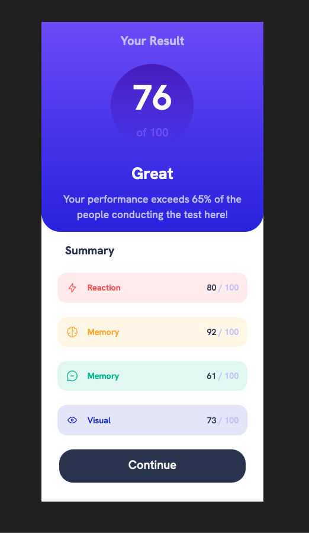

# Frontend Mentor - Results Summary Site

This is a solution to the [Results Summary component challenge on Frontend Mentor](https://www.frontendmentor.io/challenges/results-summary-component-CE_K6s0maV). Frontend Mentor challenges help you improve your coding skills by building realistic projects.

## Table of contents

- [Overview](#overview)
  - [The challenge](#the-challenge)
  - [Screenshot](#screenshot)
  - [Links](#links)
- [My process](#my-process)
  - [Built with](#built-with)
  - [What I learned](#what-i-learned)
  - [Continued development](#continued-development)
  - [Useful resources](#useful-resources)
- [Author](#author)
- [Acknowledgments](#acknowledgments)

## Overview

- A small Frontend Mentor challenge using HTML, CSS and CSS Flexbox.

### The challenge

- Build the card using HTML, CSS and CSS Flex-box.

### Screenshot



### Links

- Solution URL: https://www.frontendmentor.io/solutions/results-summary-component-using-flexbox-o_cZ6MoXvM

- Live Site URL: https://fem-results-summary-site.netlify.app/

## My process

- My process used Visual Studio Code, Firefox Developer Edition web browser and the design was with Figma.

### Built with

- Semantic HTML5 markup
- CSS custom properties
- Flexbox

### What I learned

One thing that sticks out for me was being advised to use less "max-widths" and "min-widths" and allow the internal elements such as headings, paragraphs and font sizes to organically dictate the over size of these components. When removing these the component's size remained consistant. Also I was advised that it is permissable to use flexbox for lists, and in turn to use Flex gap instead of margins on individual list items to provide the necessary spacing between items. I did not use this on this project, but going forward I will use Flexbox for list item gaps. However, I did use Flexbox within the list items to space out icons from text. Below is the code for first item on list.

```html
<!-- unordered list -->
          <ul>
            <!-- list item 1 -->
            <li class="result-1">
              <!-- icon left -->
              <div class="small-flex">
              Reaction</div>
              <!-- numbers right -->
              <span class="number">80 <span class="percentage">/ 100</span>
            </li>
            <!-- end of list item 1 -->
```

```css
li {
  display: flex;
  justify-content: space-between;
  border-radius: 1rem;
  padding: 0.9rem;
  color: hsl(0, 100%, 67%);
  font-weight: 400;
  font-size: 0.9rem;
  margin: 1.5rem;
}
```

### Continued development

- Continue to use and learn Flexbox is essential. When to use it and when not to use it.

## Author

- Frontend Mentor - https://www.frontendmentor.io/profile/John-Davidson-8
